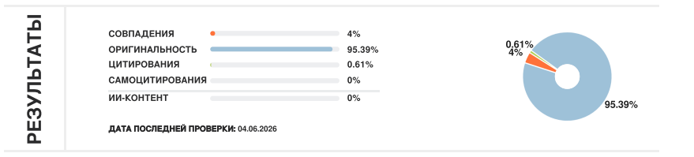
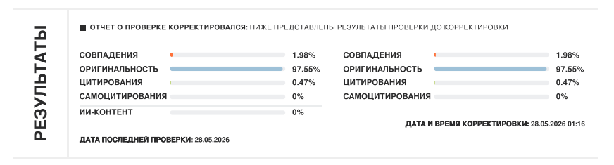
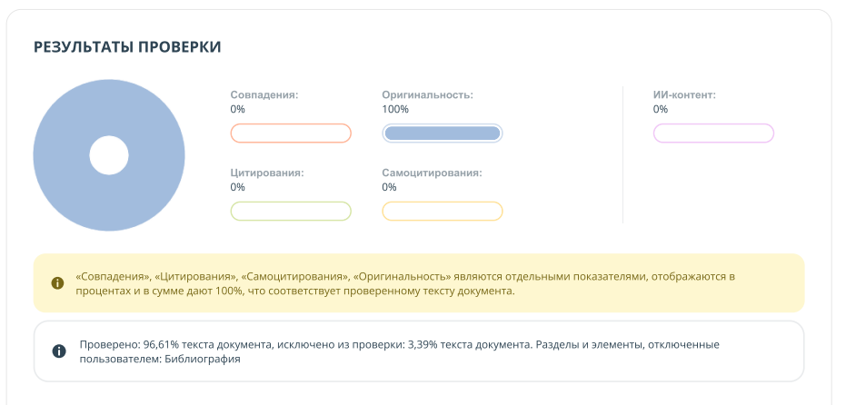

<div align="center">

# 📝 VKR Writer

**Claude Code плагин для написания ВКР — проходит антиплагиат с 0% детекции ИИ**

[](LICENSE)
[](plugins/vkr-writer/skills/)
[](https://docs.anthropic.com/en/docs/claude-code)
[](img/)

</div>

---

Плагин для Claude Code, который пишет тексты дипломных работ и магистерских диссертаций в естественном студенческом стиле. Статистически неотличим от ручного написания — системы антиплагиата не определяют ИИ-генерацию.

## Результаты проверок

| | | |
|---|---|---|
|  |  |  |
| **Антиплагиат.ру** — 95.39% оригинальность, 0% ИИ | **Антиплагиат.ру** — 97.55% оригинальность, 0% ИИ | **Другая система** — 100% оригинальность, 0% ИИ |

## Скилы

### `academic-writer` — Бакалаврская ВКР

Автоматически срабатывает на запросы написания/переписывания дипломных текстов:

- Все разделы: введение, аналитическая, проектная, технологическая, экономическая части, заключение
- UML-диаграммы через PlantUML (use case, последовательности, деятельности, классов, развёртывания)
- Проектирование БД: концептуальная → логическая → физическая модель
- Полная Глава 4: WBS, диаграмма Ганта, расчёт затрат по формулам, матрица рисков, юнит-экономика
- Форматирование docx через python-docx (совместимый стиль ЯГТУ)

### `master-thesis` — Магистерская диссертация

Автоматически срабатывает на запросы написания магистерских текстов:

- Научный регистр: безличные конструкции, авторский взгляд исследователя
- Полная структура введения: актуальность, степень разработанности, научная новизна, теоретическая и практическая значимость, апробация, положения выносимые на защиту
- Систематический обзор литературы по тематическим блокам с критическим анализом
- Оформление математических моделей, систем уравнений, нумерация формул
- Академические шероховатости магистерского уровня (не студенческие)

## Установка

```bash
claude plugin marketplace add teslaproduuction/vkr-writer
claude plugin install vkr-writer@vkr-writer
```

### Другие агенты

```bash
# Cursor, Windsurf, Cline, Copilot и другие
npx skills add teslaproduuction/vkr-writer
```

## Использование

Навыки активируются **автоматически** при соответствующих запросах:

```
"Напиши введение к диплому по автоматизации складского учёта"
"Напиши раздел 1.4 — анализ конкурентов (1С, Битрикс24, amoCRM)"
"Сделай диаграмму вариантов использования для системы заказов"
"Напиши технологическую часть: Django, PostgreSQL, React"
"Напиши экономическую часть диплома"
"Перепиши этот текст чтобы не определялся как ИИ"
"Напиши введение к магистерской по машинному обучению"
"Напиши научную новизну и положения выносимые на защиту"
"Напиши обзор литературы по теме нейронных сетей"
```

## Почему работает

ИИ-детекторы ищут статистические паттерны: одинаковую длину предложений, идеальную грамматику, симметричные конструкции, отсутствие авторского голоса. Плагин намеренно вносит:

| Техника | Эффект |
|---------|--------|
| Вариативность длины предложений (5–45 слов) | Нарушает равномерность — главный маркер ИИ |
| Разговорные вкрапления («Ну а к минусам относят:») | Имитирует авторский голос |
| Повторяющиеся авторские обороты | Характерно для реального студента |
| Стилистические шероховатости | Имитирует несовершенство живого текста |
| Неравномерность структуры абзацев | Разрушает шаблон ИИ-генерации |

## Лицензия

MIT
