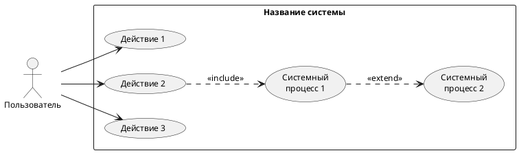
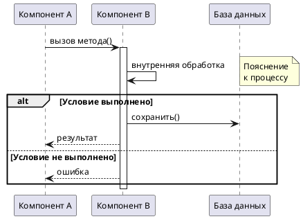
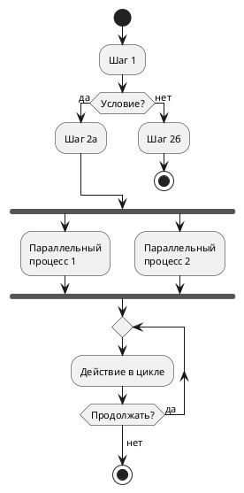
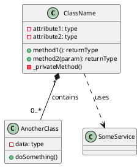
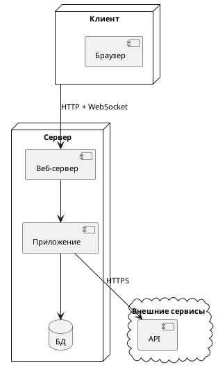
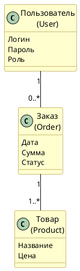
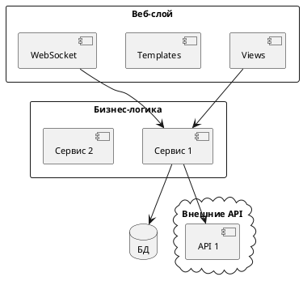

# Руководство по созданию UML-диаграмм для ВКР

Диаграммы генерируются через PlantUML (нужна Java). Команда:
```bash
java -jar plantuml.jar -charset UTF-8 -tpng -Sdpi=300 файл.puml -o "./output"
```

Параметр `-Sdpi=300` даёт разрешение 2000-4000px -- достаточно для печати.

---

## Оглавление

1. [Общие настройки skinparam](#1-общие-настройки)
2. [Диаграмма вариантов использования](#2-диаграмма-вариантов-использования)
3. [Диаграмма последовательности](#3-диаграмма-последовательности)
4. [Диаграмма деятельности](#4-диаграмма-деятельности)
5. [Диаграмма классов](#5-диаграмма-классов)
6. [Диаграмма развёртывания](#6-диаграмма-развёртывания)
7. [Концептуальная модель БД](#7-концептуальная-модель-бд)
8. [Логическая модель БД](#8-логическая-модель-бд)
9. [Диаграмма архитектуры](#9-диаграмма-архитектуры)

---

## 1. Общие настройки

Все диаграммы должны начинаться с этих skinparam для единообразного вида:

```plantuml
skinparam backgroundColor white
skinparam defaultFontName "Times New Roman"
skinparam defaultFontSize 12
```

---

## 2. Диаграмма вариантов использования

Правила:
- Только ОДИН актор -- Пользователь (внешние системы не показываются)
- Пользовательские прецеденты: действия, которые инициирует пользователь
- Системные прецеденты: автоматические процессы внутри системы
- Связи: `<<include>>` для обязательного включения, `<<extend>>` для опционального расширения
- Направление: `left to right direction` для горизонтальной компоновки



---

## 3. Диаграмма последовательности

Правила:
- Участники: компоненты системы + внешние сервисы
- Стрелки: `->` синхронный вызов, `->>` асинхронный (fire-and-forget)
- `activate`/`deactivate` для показа времени жизни
- `alt`/`else`/`end` для ветвлений
- `note right` для пояснений



---

## 4. Диаграмма деятельности

Правила:
- `start`/`stop` для начала/конца
- `:Действие;` для шагов
- `if (Условие?) then (да) / else (нет)` для ветвлений
- `fork`/`fork again`/`end fork` для параллельных процессов
- `repeat`/`repeat while` для циклов
- `floating note right` для примечаний



---

## 5. Диаграмма классов

Правила:
- Не более 5-8 классов для читаемости
- Формат: имя класса, атрибуты (- private, + public), методы
- Связи: `*--` композиция, `o--` агрегация, `..>` зависимость
- Кардинальность: `"1" *-- "0..*"`



---

## 6. Диаграмма развёртывания

Правила:
- `node` для серверов/устройств
- `component` для программных компонентов
- `database` для баз данных
- `cloud` для внешних сервисов
- Указывать протоколы на связях (HTTP, WebSocket, TCP, HTTPS)



---

## 7. Концептуальная модель БД

Правила:
- Сущности с НАЗВАНИЕМ НА РУССКОМ и 2-3 ключевыми атрибутами (не все)
- Связи с кардинальностью ("1" -- "0..*")
- Жёлтый фон для сущностей (BackgroundColor #FEFECE)
- Никаких типов данных



---

## 8. Логическая модель БД

Правила:
- Все атрибуты сущности
- PK и FK отмечены жирным
- Разделитель `--` между ключами и остальными атрибутами
- Связи с кардинальностью и типом (композиция `--o`)

```plantuml
@startuml
skinparam backgroundColor white
skinparam defaultFontName "Times New Roman"
skinparam defaultFontSize 10
skinparam linetype ortho

skinparam class {
  BackgroundColor #FEFECE
  BorderColor #A08020
  FontSize 11
  AttributeFontSize 10
}

class "User" as user {
  **PK** id
  --
  username
  password
  email
  role
  created_at
}

class "Order" as order {
  **PK** id
  **FK** user_id
  --
  total
  status
  created_at
}

user "1" --o "0..*" order
@enduml
```



---

## 9. Диаграмма архитектуры

Правила:
- `package` для группировки слоёв
- `component` для модулей
- `database` для хранилищ
- `cloud` для внешних сервисов
- Стрелки показывают направление зависимостей



---

## Физическая модель БД

Физическая модель описывается НЕ диаграммой, а таблицами в тексте документа.

Формат таблицы для Django-проектов:

| Имя поля | Тип данных | Обязательность | Прочие ограничения |
|----------|-----------|----------------|-------------------|
| id | AutoField | Да | Первичный ключ |
| name | CharField | Да | max_length=100 |
| email | EmailField | Нет | unique=True |
| role_id | ForeignKey | Да | Внешний ключ на Role |

Формат таблицы для SQL-проектов:

| Название столбца | Тип данных | Ограничения | Описание |
|-----------------|-----------|-------------|---------|
| id | INTEGER | PRIMARY KEY, AUTOINCREMENT | Идентификатор |
| name | VARCHAR(100) | NOT NULL, UNIQUE | Имя |
| created_at | DATETIME | NOT NULL | Дата создания |

Шаблонная фраза перед каждой таблицей (повторять дословно):
> "В таблице N обозначены ограничения и определены типы данных атрибутов сущности, что обозначена в логическом проектировании."
